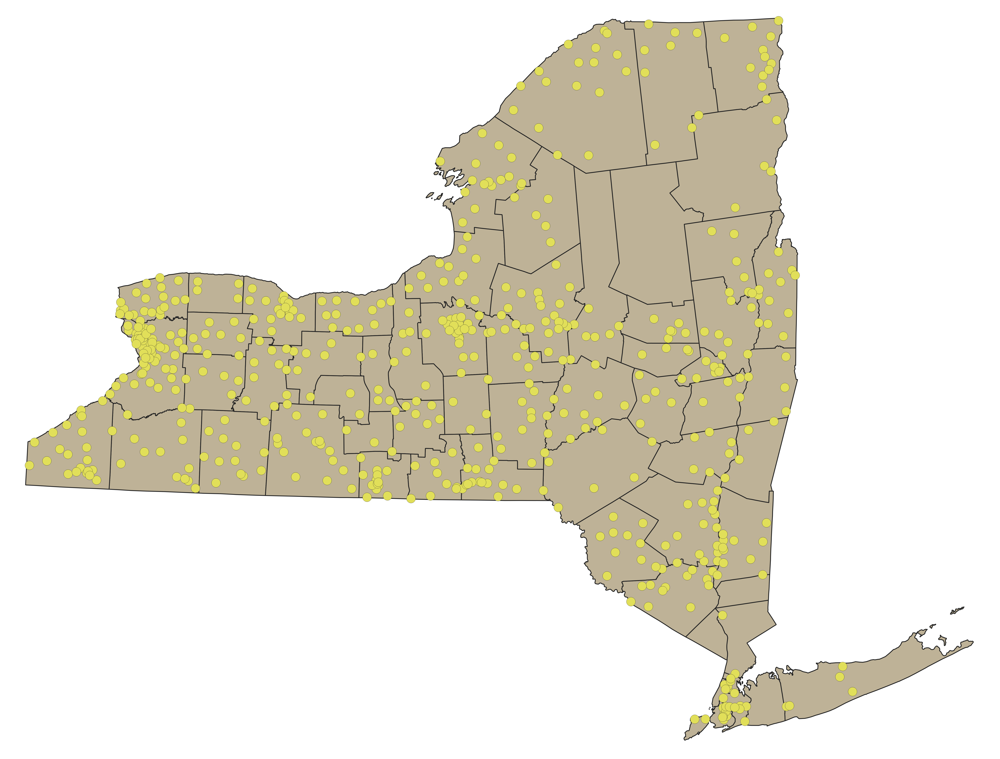
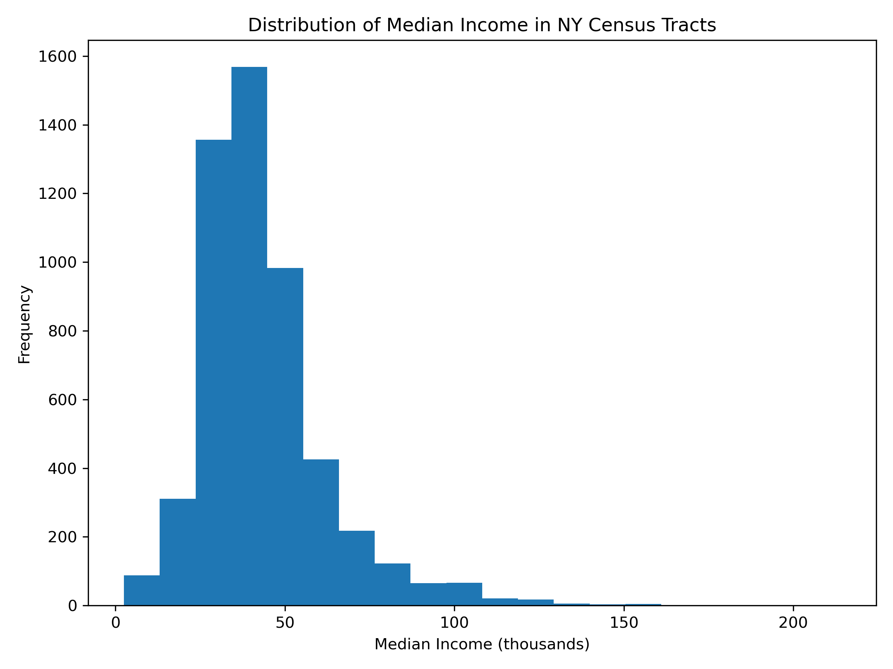
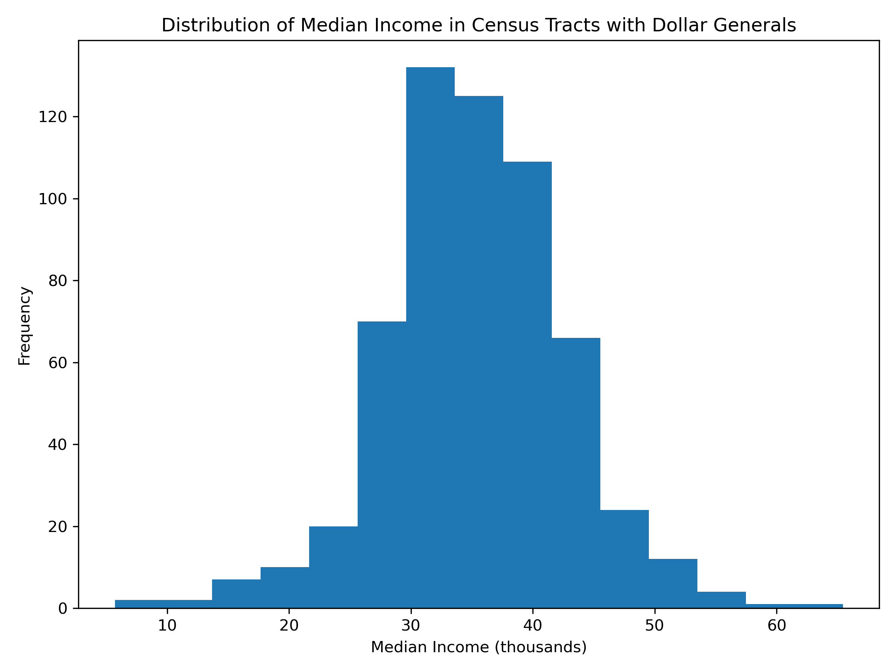
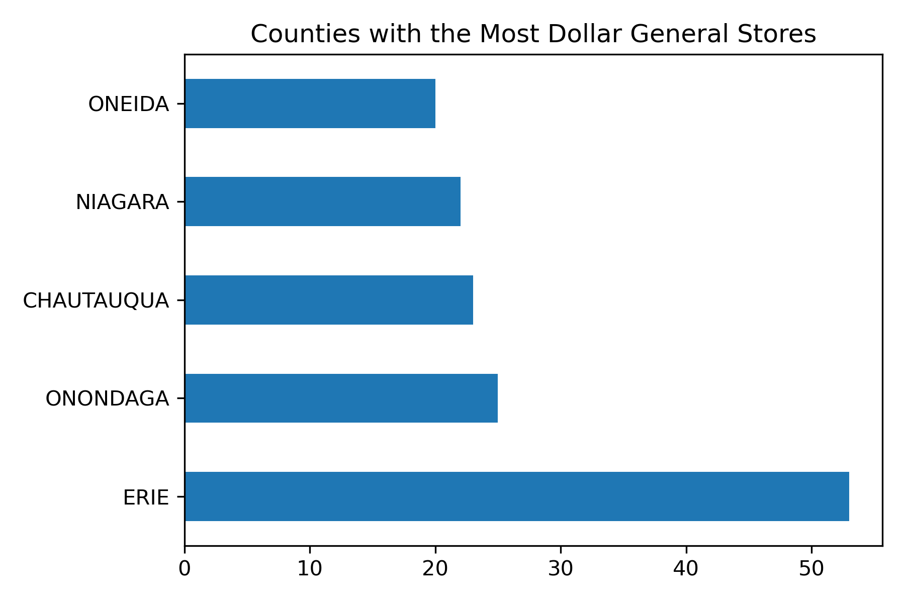
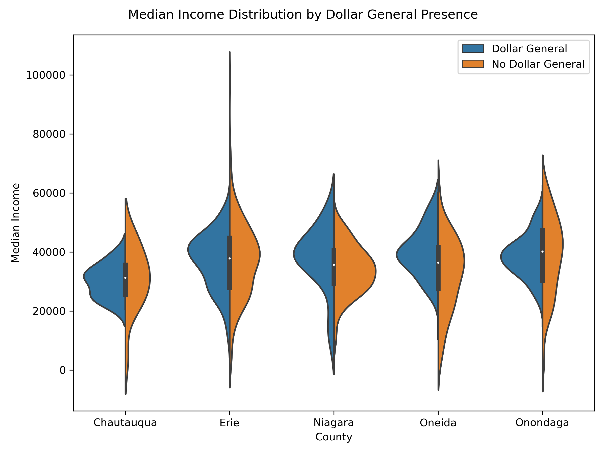
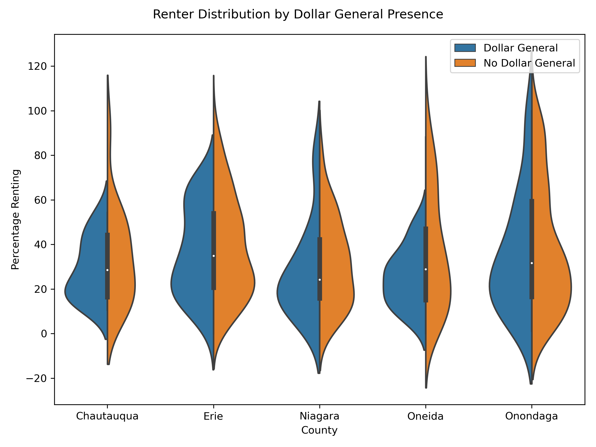
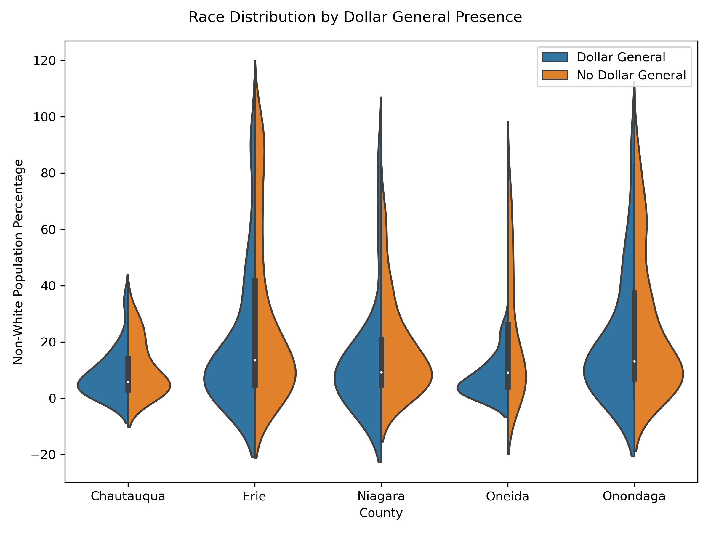
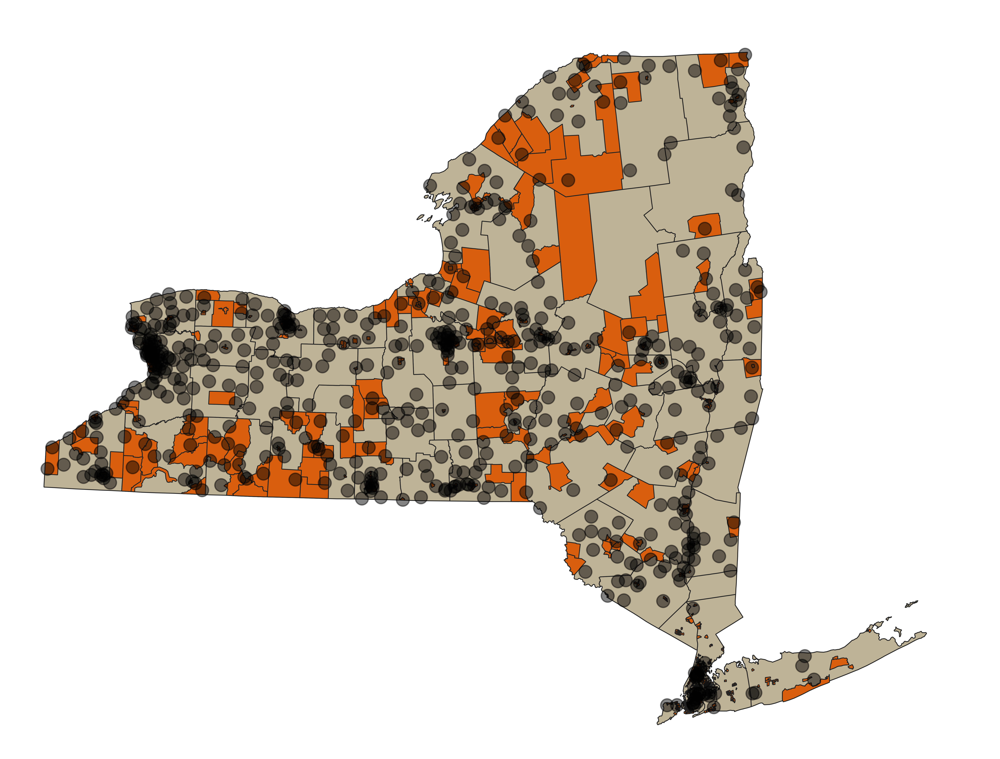
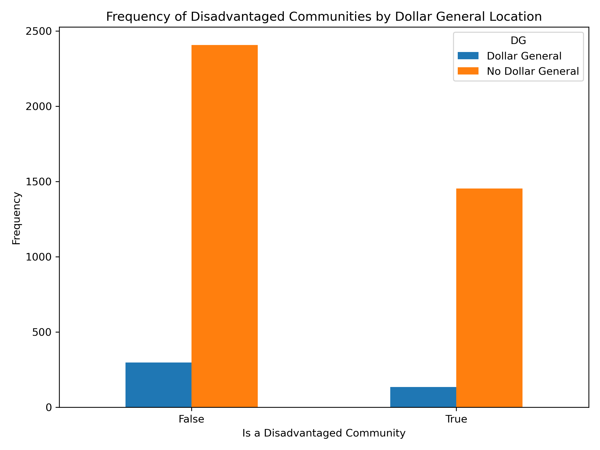
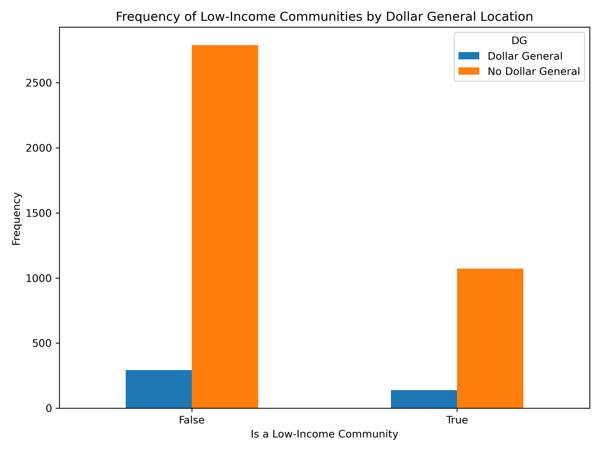

# Economic Accessibility or Exploitation? 
## A Demographic Analysis of Dollar General Locations in New York

### <u>Purpose of Analysis</u>
In recent years, Dollar General has been sued numerous times for various allegations of predatory business practices. These lawsuits include:
  - [Deceptive Pricing Allegations from Missouri's Attorney General](https://ago.mo.gov/attorney-general-bailey-files-suit-against-dollar-general-for-deceptive-pricing/)
  - [An EEOC Disability Violation](https://www.eeoc.gov/newsroom/dollar-general-pay-1-million-settle-eeoc-disability-and-gina-lawsuit)
  - [A Class Action filed in Oklahoma for Alleged Deceptive Pricing ](https://topclassactions.com/lawsuit-settlements/consumer-products/dollar-general-class-action-claims-stores-charges-higher-prices-at-register-than-advertised-on-shelves/)

Given the recurring allegations regarding Dollar General, and the [payouts](https://www.businessinsider.com/dollar-general-overcharging-shoppers-at-checkout-according-state-governments-customers-2023-11) that the company has recently disbursed in response to some of the lawsuits, demographic analysis is necessary to understand if certain populations are being disproportionately impacted by the company's alleged predatory behavior. Using geographic and demographic data from the Census, storefront data from New York Open Data, and disadvantaged community data from the Climate and Economic Justice Screening Tool, I analyze Dollar General locations across the state and try to identify if the stores are disproportionately located in disadvantaged communities.

### <u>Dollar General Locations in New York</u>

There are 585 Dollar General stores in the state of New York. 
### <u>Input Data</u> 
All input data can be found in the 'Inputs' folder within the repository, except for data retrieved via an API call which occurs in [a subsequent script](2_censusdata.py). An explanation for each datasource can be found below. 
  
  1. [Retail Food Data](https://data.ny.gov/Economic-Development/Retail-Food-Stores/9a8c-vfzj/about_data): This dataset provides storefront information for every retail food establishment in the state of New York, as of February 2024. 
  2. [Census Cartographic Boundary Shapefiles](https://www.census.gov/geographies/mapping-files/time-series/geo/cartographic-boundary.2022.html#list-tab-1883739534): For this project, I used both [county-level](Inputs/cb_2022_us_county_500k.zip) and [tract-level](Inputs/cb_2022_36_tract_500k.zip) data in my analysis. 
  3. [Climate and Economic Justice Screening Tool](https://screeningtool.geoplatform.gov/en/downloads#3/33.47/-97.5): The data provided on this website provides different measures for disadvantaged communities, along with shapefiles. In this project I used shapefiles and the [csv file](Inputs/1.0-communities.csv) providing descriptive analysis of census tract demographics. The shapefile is the .gitignore, due to its size, but it can be downloaded [here](https://screeningtool.geoplatform.gov/en/downloads#3/33.47/-97.5) (titled "Shapefile"). 
  4. Census API Call: This occurs in [2_censusdata.py](), and is done without an API key so a key is not necessary to run this script. The call returns demographic information for New York census tracts, including race, income, and percentage of citizens renting their housing. 

### <u>Python Scripts</u>
There are seven scripts in this repository, labeled in the order they are to be ran. 
- [1_NYDGs.py]() reads the retail store data and trims it to include only Dollar Generals in New York. It generates [NYDGs.csv](Outputs/NYDGs.csv) and conducts preliminary descriptive analyses about areas in New York that are highly populated with Dollar General stores.
- [2_censusdata.py]() conducts the previously mentioned API call. Additionally, it creates a GEOID column in the created dataframes which will be used to merge future data. The outputs of this script are [census_data.csv](Outputs/census_data.csv) and [census_data_tract.csv](Outputs/census_data_tract.csv).
- [3_map.py]() formats location information into a geopackage with layers for New York counties, Dollar General store locations, and Disadvantaged Community information. The outputs for this script are [NYDGs.gpkg](Outputs/NYDGs.gpkg) and [DGjoined.csv](Outputs/DGjoined.csv).
- [4_join.py]() cleans previously created csv files and merges them to create [merged.csv](Outputs/merged.csv). This csv file includes demographic and location information for each Dollar General in the state. 
- [5_top5.py]() identifies the top five counties in New York with the most Dollar General locations and makes a bar graph with this information. This script also produces two median income distributions: one containing the median income for all of New York's census tracts, and one containt the median income for the census tracts that contain dollar generals. The outputs of this scripts are: [most-stores.png](Outputs/most-stores.png), [med-incomeDG.png](Outputs/med-incomeDG.png), and [med-incomeNY.png](Outputs/med-incomeNY.png).
- [6_demographic.py]() conducts the demographic analysis using location and Census data. Results are discussed below, but the script produces: [is_notDG.csv](Outputs/is_notDG.csv), [nonwhite.png](Outputs/nonwhite.png), [renter.png](Outputs/renter.png), and [medincome.png](Outputs/medincome.png).
- [7_CEJSanalysis.py](): This script conducts demographic analysis using the measures created through the Climate and Economic Justice Screening Tool for Disadvantaged and Low-Income Communities. Results are discussed below, but the script produces: [disadvantaged.png](Outputs/disadvantaged.png), [low-income.png](Outputs/low-income.png), as well as two linear probability models. 

### <u>Outputs</u>
All of the discussion regarding the results of my analysis are based on products of my scripts, located in the Outputs folder. 
   
*Note: The linear probability models are not included in the output folder, but they appear in the kernel when the script is ran in Spyder. Also, the script will not produce the maps but will produce [NYDGs.gpkg](Outputs/NYDGs.gpkg) which can then be used to reproduce the maps in QGIS.*

### <u>Results</u>

**Finding 1: Dollar Generals in New York are not located in any Census tract that has a median income higher than $60,000 per year.**

I initially intended to conduct an analysis showcasing the distribution of demographic characteristics for the whole of the state in comparison to Census tracts where Dollar Generals were located. I did not feel that this visualization led to a comprehendable comparison of the distributions, though these graphs  show that the income distribution for Census tracts where Dollar Generals are located stops at $60,000. 
 

**Finding 2: The bulk of Dollar General locations are outside of New York City.**

The county with the most stores is Erie, with 55 separate locations. 


**Finding 3:  Within the counties that have the most Dollar General stores, the distributions of race, percentage renting, and median income do not greatly vary given the presence of a Dollar General in a Census Tract.**
These split violin plots measure the distributions for median income, percentage renter, and percentage of non-white individuals in a given Census tract. 
The distributions do not vary enough to make a decisive conclusion regarding the disproportionate impact of the stores' locations. However, it does seem that the distribution for tracts with Dollar Generals is narrower for each of these variables. This could suggest that the company is locating in areas within a specific demographic window.
 



**Finding 4: A map of Dollar General stores onto Disadvantaged Communities suggest that there is little correlation between the two variables.**


Here, the dots represent stores and orange census tracts are communities that have been identified as disadvantaged by the Climate and Economic Justice Screening Tool. As was predicted by the previously created bar graph, there are areas in the state where there are clusters of stores. However, this doesn't seem to be a predictor for disadvantaged communities. 

### <u>Disadvantaged Communities and Dollar Generals in New York</u>


**Finding 5: The proportion of Disadvantaged and Low-Income Communities is similar for both Census tracts with and without Dollar Generals.**


The Climate and Economic Justice Screening tool provides proxy-measures for communities that categorize them as 'disadvantaged' and 'low-income'. Based on the graphs below, it does not seem that Dollar General is specifically choosing locations with these characteristics. 



**Finding 6: Being a low-income or disadvantaged community is not a statistically significant predictor for Dollar General presence within a census tract.**

I ran two linear probability models to try to identify a predictive relationship between variables that could have been missed in my visualizations.

 The first model is trying to ascertain the likelihood of a Dollar General being located in a census tract, given that the census tract is considered disadvantaged. This model suggests that being a disadvantaged community decreases the likelihood of the presence of a Dollar General by two percentage points, all else equal. 
 ```python
                           OLS Regression Results                            
==============================================================================
Dep. Variable:                     DG   R-squared:                       0.002
Model:                            OLS   Adj. R-squared:                  0.001
Method:                 Least Squares   F-statistic:                     7.654
Date:                Mon, 29 Apr 2024   Prob (F-statistic):            0.00569
Time:                        16:58:53   Log-Likelihood:                -927.24
No. Observations:                4291   AIC:                             1858.
Df Residuals:                    4289   BIC:                             1871.
Df Model:                           1                                         
Covariance Type:                  HC3                                         
==============================================================================
                 coef    std err          z      P>|z|      [0.025      0.975]
------------------------------------------------------------------------------
intercept      0.1099      0.006     18.260      0.000       0.098       0.122
DAC           -0.0255      0.009     -2.767      0.006      -0.044      -0.007
==============================================================================
Omnibus:                     2201.926   Durbin-Watson:                   1.579
Prob(Omnibus):                  0.000   Jarque-Bera (JB):             9588.185
Skew:                           2.652   Prob(JB):                         0.00
Kurtosis:                       8.050   Cond. No.                         2.43
==============================================================================

Notes:
[1] Standard Errors are heteroscedasticity robust (HC3)
 ```

The second model is attempting to understand the likelihood of a Dollar General being located in a Census tract, given that the Census tract is considered to be low-income. The results from this are not statistically significant, and I cannot reject the null that being a low-income community impacts the likelihood of presence of a Dollar General. 
 ```python
    OLS Regression Results                            
==============================================================================
Dep. Variable:                     DG   R-squared:                       0.001
Model:                            OLS   Adj. R-squared:                  0.001
Method:                 Least Squares   F-statistic:                     3.565
Date:                Mon, 29 Apr 2024   Prob (F-statistic):             0.0591
Time:                        16:58:53   Log-Likelihood:                -928.92
No. Observations:                4291   AIC:                             1862.
Df Residuals:                    4289   BIC:                             1875.
Df Model:                           1                                         
Covariance Type:                  HC3                                         
==============================================================================
                 coef    std err          z      P>|z|      [0.025      0.975]
------------------------------------------------------------------------------
intercept      0.0948      0.005     17.955      0.000       0.084       0.105
low_income     0.0200      0.011      1.888      0.059      -0.001       0.041
==============================================================================
Omnibus:                     2204.722   Durbin-Watson:                   1.573
Prob(Omnibus):                  0.000   Jarque-Bera (JB):             9616.821
Skew:                           2.655   Prob(JB):                         0.00
Kurtosis:                       8.059   Cond. No.                         2.44
==============================================================================

Notes:
[1] Standard Errors are heteroscedasticity robust (HC3)
 ```

### <u>Conclusion</u>

Based on the findings from my analyses, I cannot conclude that Dollar General is choosing to locate its stores in communities with disproportionate demographics. This leads me to believe that any alleged predatory behavior being conducted by the company is not being felt disproportionately by a disadvantaged community, as my analysis looked at multiple proxies for this measure and failed to find a notable difference in the distribution of demographics given the presence of a Dollar General in a Census tract. Future research should be done to validate this finding, and could be extended to states with larger numbers of Dollar General stores and smaller populations to ensure that the findings are externally valid. 
